# 3 tópicos interessantes de Matemática e Física para desenvolvimento de jogos

Olá! Na lição de hoje eu vou mostrar pra vocês alguns conceitos matemáticos/físicos muito utilizados nos video games. São estes:

1. Vetores
2. Função Seno  
3. Forças

---
## I. Vetores  

Pra começar, vamos falar de vetores e **por que eles são úteis para video games**.
Características dos vetores:
- Vetores são grandezas representadas por uma seta que possuem direção e magnitude (também chamado de módulo).
- Precisam de um ponto de referência, seja a origem (0, 0) ou um ponto qualquer (um player por exemplo).

> **Vetores são como direções em um mapa do tesouro**. Exemplo: "Ande 10 passos para a esquerda". Nesse caso "10 passos" é a **magnitude** do vetor, ou seja, o tamanho dele; já "para a esquerda" é a **direção** do vetor

Considere este exemplo. O vetor tem coordenadas (2, 1) em relação ao ponto (1, 1), que é a sua origem. Em outras palavras, o ponto B está a 2 passos de A no eixo horizontal (eixo X) e a 1 passo de A no eixo vertical (eixo Y). É só contar!

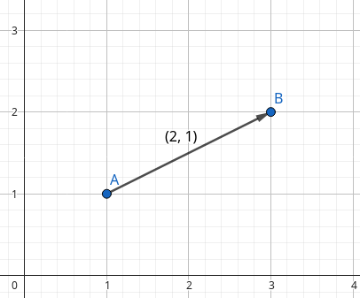

### Qual a utilidade para desenvolvimento de jogos?
Vamos supor que temos dois jogadores no mapa de um jogo de RPG top down. No código de nosso jogo, temos acesso às coordenadas dos jogadores A e B. Porém, vamos supor que nós precisamos achar a distância entre esses dois jogadores para fins de interatividade entre eles. 

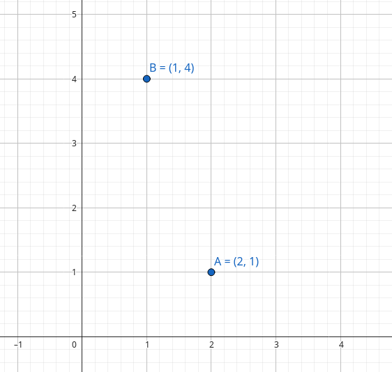

Nesse caso podemos achar o vetor que faz o player A ir até o B, mas como? Através de uma subtração de vetores, que é muito simples, basta realizar a operação em cada componente do vetor. 

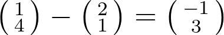

Assim temos que o vetor que representa a distância de A até B é (-1, 3)

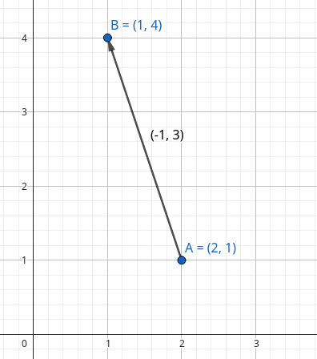

Bom, essa informação ainda não nos diz exatamente a distância entre os jogadores. Para isso, nós temos que calcular o módulo do vetor. Com esse fito, devemos imaginar o vetor como sendo a hipotenusa de um triângulo retângulo formado pelas diferenças de suas coordenadas iniciais e finais, como mostra essa belíssima figura que encontrei no google:

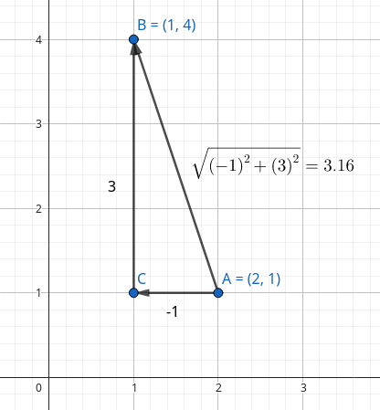

Resumidamente, um simples teorema de pitágoras encontra o módulo desse vetor e, consequentemente, a distância entre os jogadores A e B.

E lembrando que todas essas relações também funcionam com um plano de 3 dimensões. Basta adicionar o eixo Z.

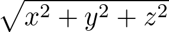

# II. Função Seno

Observe esse pequeno protótipo:

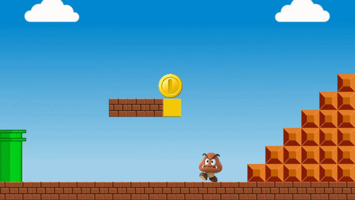

Veja como o inimigo e a moeda se mexem. Todos eles recebem em suas posições cartesianas o resultado da função seno

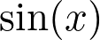

Essa função retorna valores entre 1 e -1, dependendo do valor de entrada X que você especificar. Este é um ângulo, medido em graus ou radianos. Além disso, vale lembrar que o seno é o eixo das ordenadas no cirulo trigonométrico.

Não irei me aprofundar nesses tópicos pois eu teria que explicar toda a trigonometria básica nesse artigo, e meu objetivo é apenas apresentar e relembrar os conceitos e suas utilidades para desenvolvimento de games. Portanto, estou supondo que você conheça esses tópicos.

### Manipulações possíveis

**Amplitude**

Esta é a função seno em sua forma padrão.
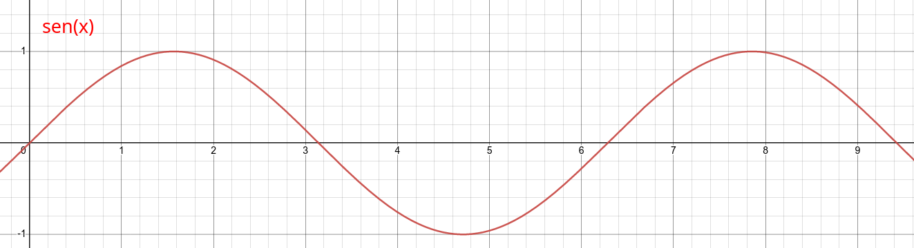

Mas a função seno retorna valores entre 1 e -1, que são muito pequenos para serem mostrados na tela de um computador, pois é como se o valor máximo de sen(x) fosse 1 pixel da tela.
Para consertarmos isso precisamos aumentar a amplitude da função. Para isso podemos, simplesmente, multiplicar o seno por um número qualquer.

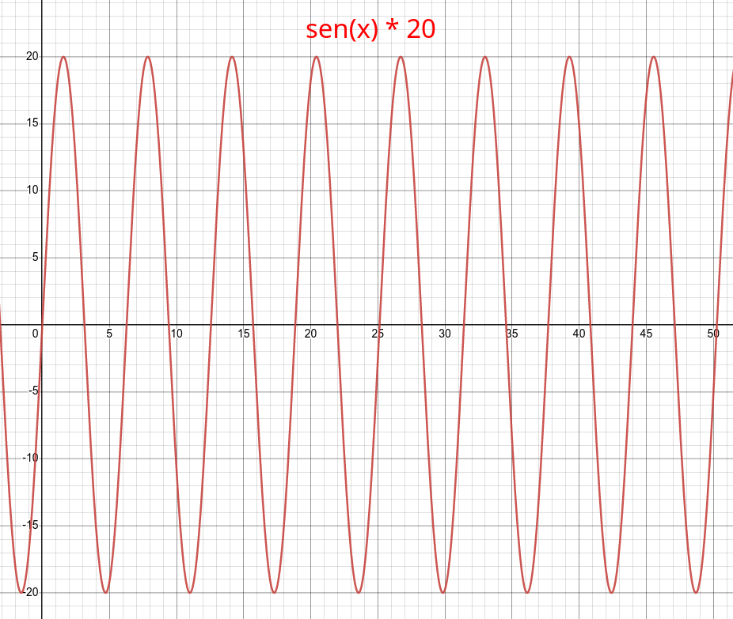

Veja que agora os valores máximo e mínimo são 20 e -20, e com certeza 20 pixels são bem mais visíveis para o usuário kkkk.

**Velocidade**

Entretanto, apesar de termos consertado a amplitude, ainda temos um problema. O período, ou seja, o tempo que leva para acontecer uma repetição no gráfico, é muito pequeno. Isso quer dizer que a velocidade ou frequência é muito alta e pode acontecer algo parecido com isso:

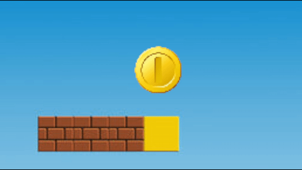

Para isso temos que multiplicar X por um valor a fim de diminuir ou aumentar a velocidade.  
Exemplos:

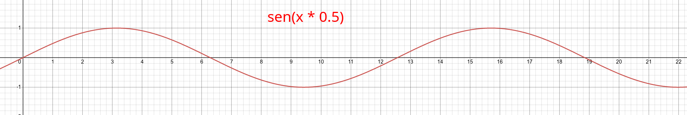
> Diminuindo a velocidade pela metade

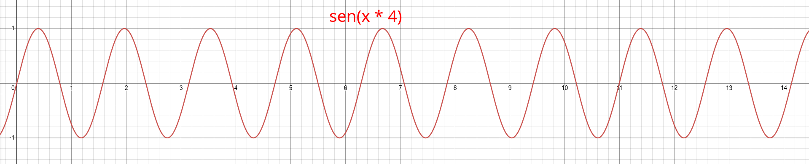
> Quadruplicando a velocidade

## III. Forças
Dentre os tópicos este é o mais simples de explicar, pois basta lembrar da Segunda Lei de Newton e da Lei da Gravitação Universal. Essas são as mais utilizadas.

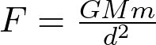

Com elas você pode fazer várias coisas legais, como um mini simulador de gravitação universal:

Enfim, o céu é o limite.
Espero ter ajudado vocês em algo. Obrigado pela atenção!